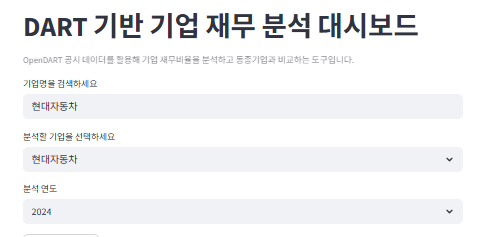
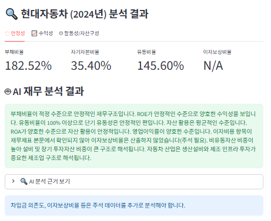
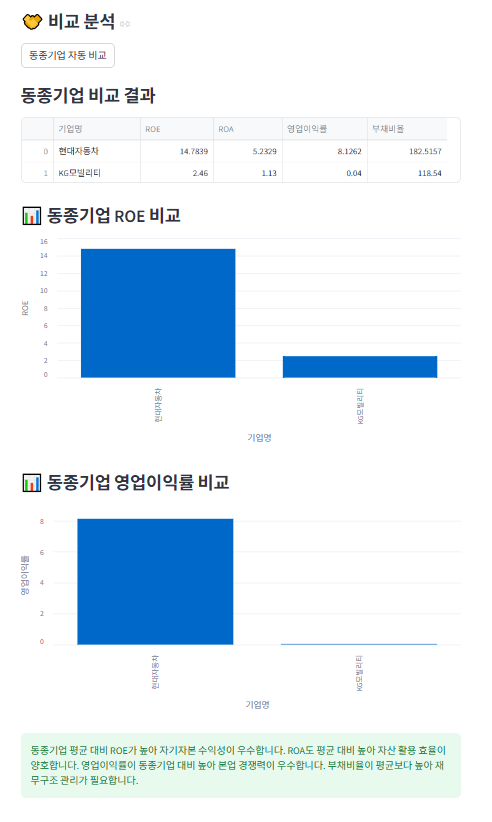

# DART Financial Analysis Tool

## 프로젝트 소개
OpenDART 공시 데이터를 활용하여 기업 재무제표를 자동 분석하고 동종기업과 비교할 수 있는 재무 분석 도구입니다.

## 주요 기능
- 기업 검색 및 재무제표 자동 수집
- 안정성 / 수익성 / 활동성 지표 자동 계산
- AI 기반 재무 분석 결과 제공
- 동종기업 비교 및 그래프 시각화

## 사용 기술
- Python
- Streamlit
- OpenDART API
- Pandas
- Altair

## 실행 방법
pip install -r requirements.txt
streamlit run app.py

## 실행 화면
### 첫 화면(기업 이름 검색)

### 재무 분석 결과

### 동종기업 비교

